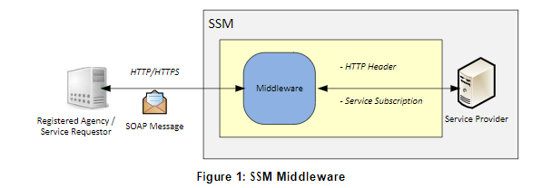
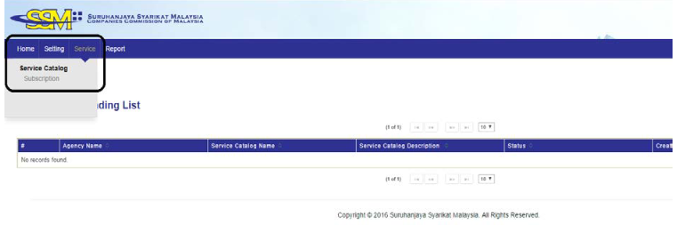
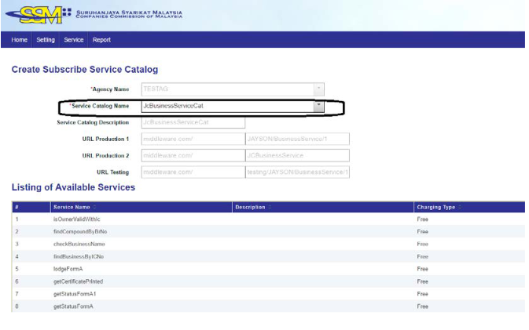
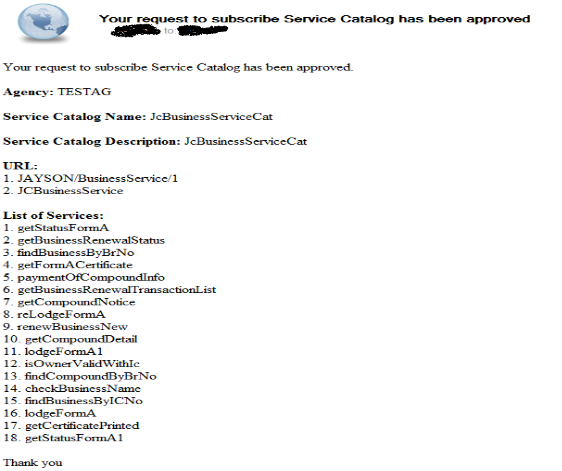

# Getting Started

## 1. Glosary
The following specify terms and abbreviations used in this document and their definitions that are needed to understand this document.


Abbreviations |  Definition
:------------ | -------------
SSM | Suruhanjaya Syarikat Malaysia
MB | Mesiniaga Berhad
Hash | Hash is a one way function -it cannot be decrypted back.
SHA | Secure Hash Algorithmis one of a number of cryptographic hash functions.
SHA256 | SHA-256 variant of SHA algorithm generates an almost-unique, fixed size 256-bit(32-byte) hash.
Base64 | A group of similar binary-to-text encoding schemes that represent binary data in an ASCII string format by translating it into a radix-64 representation.

---

#### Table 1 : Glossary Table

## 2. SSM Middleware
This  document  describes  the  interface  standard  for  integrating  to  SSM  Middleware.  It  covers  the  transport protocol, web service standard and subscription requirement. As illustrstrated below, there are   few   security   configurations   and   settings   need   to   be implemented   to   ensure   secure   communication between servie requestor and service provider. 

#### 

### 2.1 What needs to be done for connecting to SSM Middleware

|  |  | Example |
| ------------ | ------------- | ------------ |
| 1 | Service Requestor (i.e. Agency) need an account in Middleware System. <br>Please refer to [3.1](#31-agency-profile)| Liaosn with SSM Business Development team to have an account in the SSM Middleware. Login credential, username & password, will be sent to respective Service Requestor once the service requestor account is created.  | 
| 2 | Service Requestor is required to subscribe the services from the Service Catalog. <br> Please refer to 0  | Service Requestor login to system by using the login credential provided by the SSM. |
| 3 | Modifythe application for calling requeird services. <br>Please refer to [4](#4-http-header-token-authentication) for username token implementation  | - Perform wsdl URL call to SSM Middleware to extract the webservice signature (WSDL). <br> - Develop soap message as per the SSM Middleware soap message standard. <br> - Inlcude HTTP Server username token as per SSM Middleware standard.  |
| 4|  Service Requestor application requires to connect SSM Middleware through HTTPS.  | HTTPS will be implemented in SSM Middleware. |

---
## 3. Subscription Process

#### 

* Each Service Requestor / Agency is required to register an account in SSM Middleware before it can connect to Middleware.
* Username and password will be sent to Service Requestor via email once the account is created.
* Service Requestor subscribes to the services by using the provided username and password. 
* The service subscription is required approval from SSM. Once the subscription is approved, Service Requestor is able to connect the SSM Middleware as long as the request message compliance to interface message format.


### 3.1 Agency Profile

a. SSM MBDD need to create an account in Middleware for agency.<br>
b. Once agency profile is created, a notification email will be sent to the agency.<br>
c. Email content include the admin user details.<br>
<br>
d. After that, you can use username and password to login the system.<br>
<br>
e. Once login success will go to landing page.<br>


### 3.2 Service Catalog – Service Subscription

a. Login into the  system<br>
<br>

b. Select the Subscription screen<br>
<br>

c. Subscription New Service<br>
<br>

d. Select the service category to subscribe<br>
<br>

e. Once confirm click on the “save” button<br>
<br>

f. After click subscribe button will pending SSM approval to approve it.<br>
g. Receive email when the service category approved.<br>


### 3.3 ENDPOINT URL
You can view the endpoint URLs for your subscribed service catalogs in the integrasi portal. They look similar to the samples below.<br><br>
Production URL:<br>
https://integrasi.ssm.com.my/{Service Catalog Name}/{version no}<br><br>
Testing URL:<br>
https://integrasi.ssm.com.my/testing/{Service Catalog Name}/{version no}<br><br>
Example:<br>
https://integrasi.ssm.com.my/BusinessService/1

### 3.4 Message Format

=== "Sample Request Message"
    ``` xml 
    <soapenv:Envelope xmlns:soapenv="http://schemas.xmlsoap.org/soap/envelope/">
        <soapenv:Header/>
        <soapenv:Body>
            <rob:FindBusinessByBrNo xmlns:rob="urn:ssm/rob">
                <header>
                </header>
                    <customerId>AGENCY</customerId>
                    <customerReferenceNo>1234</customerReferenceNo>
                    <customerTransactionDate>2016-08-09T16:00:00.000Z</customerTransactionDate>
                <request>
                    <brNo>001234567</brNo>
                    <agencyBranchCode>KL</agencyBranchCode>
                </request>
            </rob:FindBusinessByBrNo>
        </soapEnv:Body>
    </soapEnv:Envelope>
    ```
=== "Good Response Message"
    ``` xml 
    <soapenv:Envelope xmlns:soapenv="http://schemas.xmlsoap.org/soap/envelope/">
        <soapenv:Header/>
        <soapenv:Body>
            <rob:FindBusinesByBrNoResponse xmlns:rob="urn:ssm/rob">
                <header>
                    <customerId>AGENCY</customerId>
                    <customerReferenceNo>1234</customerReferenceNo>
                    <customerTransactionDate>2016-08-09T16:00:00.000Z</customerTransactionDate>
                    <serviceCode>CBS00002</serviceCode>
                    <versionNumber>1</versionNumber>
                    <errorCode/>
                    <errorMessage/>
                    <recordCount>1</recordCount>
                    <requestTimestamp>2016-08-09T16:00:00.123Z</requestTimestamp>
                    <responseTimestamp>2016-08-09T16:00:00.567Z</responseTimestamp>
                    <hostReferenceNo/>
                    <hostStatusCode/>
                    <hostStatusMessage/>
                </header>
                <request>
                    <brNo>001234567</brNo>
                    <agencyBranchCode>KL</agencyBranchCode>
                </request>
                <response>
                    <businessInfoList>
                        <businessInfo>
                            <businessName>...</businessName>
                            ...
                        </businessInfo>
                </response>
            </rob:FindBusinessByBrNoResponse>
        </soapenv:Body>
    </soapenv:Envelope>
    ```
=== "Error Response Message"
    ``` xml
    <soapenv:Envelope xmlns:soapenv="http://schemas.xmlsoap.org/soap/envelope/"><soapenv:Header/>
        <soapenv:Body>
            <rob:FindBusinesByBrNoResponse xmlns:rob="urn:ssm/rob">
                <header>
                    <customerId>AGENCY</customerId>
                    <customerReferenceNo>1234</customerReferenceNo>
                    <customerTransactionDate>2016-08-09T16:00:00.000Z</customerTransactionDate>
                    <serviceCode>CBS00002</serviceCode>
                    <versionNumber>1</versionNumber>
                    <errorCode>ESB00002</errorCode>
                    <errorMessage>Host Time-out</errorMessage>
                    <recordCount>0</recordCount>
                    <requestTimestamp>2016-08-09T16:00:00.123Z</requestTimestamp>
                    <responseTimestamp>2016-08-09T16:00:35.567Z</responseTimestamp>
                    <esbHost>mwmbp01.ssm.com.my</esbHost>
                    <hostReferenceNo/>
                    <hostStatusCode/>
                    <hostStatusMessage/>
                </header>
                <request>
                    <brNo>001234567</brNo>
                    <agencyBranchCode>KL</agencyBranchCode>
                </request>
            </rob:FindBusinessByBrNoResponse>
        </soapenv:Body>
    </soapenv:Envelope>
    ```

### **Message Header Fields**

<table>
    <thead>
        <tr>
            <th colspan=5>Request Header</th>
        </tr>
    </thead>
    <tbody>
        <tr>
            <td></td>
            <td>Name</td>
            <td>Type</td>
            <td>Length</td>
            <td>Remarks</td>
        </tr>
        <tr>
            <td>1</td>
            <td>VersionNumber</td>
            <td>CHAR</td>
            <td>3</td>
            <td></td>
        </tr>
        <tr>
            <td>2</td>
            <td>serviceCode</td>
            <td>CHAR</td>
            <td>10</td>
            <td></td>
        </tr>
        <tr>
            <td>3</td>
            <td>customerID</td>
            <td>CHAR</td>
            <td>10</td>
            <td></td>
        </tr>
        <tr>
            <td>4</td>
            <td>customerReferenceNo</td>
            <td>CHAR</td>
            <td>40</td>
            <td></td>
        </tr>
        <tr>
            <td>5</td>
            <td>customerRequestDate</td>
            <td>CHAR</td>
            <td></td>
            <td>yyyy'-'MM'-'dd'T'hh':'mm':'ss'.'SSS</td>
        </tr>
    </tbody>
</table>

---

<table>
    <thead>
        <tr>
            <th colspan=5>ResponeHeader</th>
        </tr>
    </thead>
    <tbody>
        <tr>
            <td></td>
            <td>Name</td>
            <td>Type</td>
            <td>Length</td>
            <td>Remarks</td>
        </tr>
        <tr>
            <td>1-5</td>
            <td>Fields 1-5 will repeat from request</td>
            <td></td>
            <td></td>
            <td></td>
        </tr>
        <tr>
            <td>6</td>
            <td>serverHost</td>
            <td>CHAR</td>
            <td>30</td>
            <td></td>
        </tr>
        <tr>
            <td>7</td>
            <td>requestTimestamp</td>
            <td>CHAR</td>
            <td></td>
            <td>yyyy'-'MM'-'dd'T'hh':'mm':'ss'.'SSS</td>
        </tr>
        <tr>
            <td>8</td>
            <td>responseTimestamp</td>
            <td>CHAR</td>
            <td></td>
            <td>yyyy'-'MM'-'dd'T'hh':'mm':'ss'.'SSS</td>
        </tr>
        <tr>
            <td>9</td>
            <td>recordCount</td>
            <td>INT</td>
            <td></td>
            <td></td>
        </tr>
        <tr>
            <td>10</td>
            <td>errorCode</td>
            <td>CHAR</td>
            <td>10</td>
            <td></td>
        </tr>
        <tr>
            <td>11</td>
            <td>errorMessage</td>
            <td>CHAR</td>
            <td>100</td>
            <td></td>
        </tr>
        <tr>
            <td>12</td>
            <td>hostErrorCode</td>
            <td>CHAR</td>
            <td>10</td>
            <td></td>
        </tr>
        <tr>
            <td>13</td>
            <td>hostErrorMessage</td>
            <td>CHAR</td>
            <td>100</td>
            <td></td>
        </tr>
    </tbody>
</table>

## 4. HTTP Header - Token Authentication

A  method  for  a  Service  Requestor  to  provide  a  user  name  and  timestamp  when  making  a  service request to Middleware. When a Service Provider wants to send the server authentication credentials it may use the Authorization field. Authorization field will be put on the Header of request.<br>

Token Authentication have two step to produce Authorization field.<br>
**A. The digest is constructed as follows:**<br>

 1. The username, timestamp and password are combined with a vertical bar. Because timestamp will be included on the concatString = username|timestamp|password

 2. The resulting string is hashed using SHA256.hashByte = SHA256(concatString)

 Example:

 1. Username: Tester, timestamp: 2016-05-31 11:39:35, digest: AAmsv8KNchbMY4GHViINjp/B4OVraiEdUZccaojqGhA=Tester|2016-05-31 11:39:35|AAmsv8KNchbMY4GHViINjp/B4OVraiEdUZccaojqGhA=

 2. Base64.encode(username|timestamp|digest) VGVzdGVyfDIwMTYtMDUtMzEgMTE6Mzk6MzV8QUFtc3Y4S05jaGJNWTRHSFZpSU5qcC9CNE9WcmFpRWRVWmNjYW9qcUdoQT0=

 3. Authorization: VGVzdGVyfDIwMTYtMDUtMzEgMTE6Mzk6MzV8QUFtc3Y4S05jaGJNWTRHSFZpSU5qcC9CNE9WcmFpRWRVWmNjYW9qcUdoQT0=

### 4.1 Java library for generating username token 


### 4.2 .NET library for generating username token


## 5. Transport Protocol - HTTPS

HTTPS  is  a protocol for secure communication  over  a computer  network which  is  widely  used  on  the Internet.   HTTPS   consists   of   communication   over Hypertext   Transfer   Protocol (HTTP)   within   a   connection encrypted by [Transport Layer Security or its predecessor](https://en.wikipedia.org/wiki/Transport_Layer_Security), Secure Sockets Layer. The main motivation for HTTPS is [authentication](https://en.wikipedia.org/wiki/Authentication) of the  visited website and protection of the privacy and integrity of the exchanged data. [1] 
